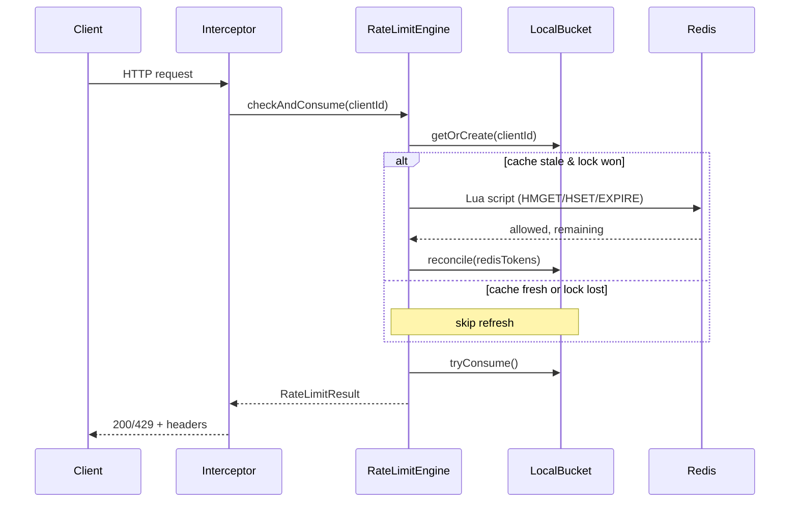
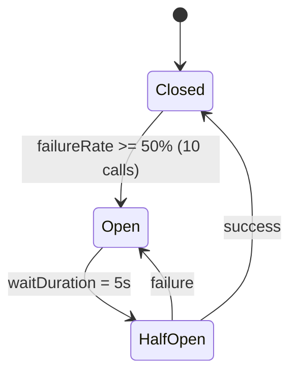

# DRL-1 — Distributed Rate Limiter

A production-grade distributed rate limiter with Gotham-styled Grafana dashboards, Loki-backed log panels, and structured JSON logging. Built with Spring Boot 3.3.4 on JDK 21 virtual threads.

---

## Overview

- **Redis-authoritative** rate limiting with a local 500ms read-through cache
- **Circuit-breaker guarded** Redis refresh path for graceful degradation
- **Structured JSON logging** wired to Loki + Grafana
- **Micrometer metrics** with Prometheus scraping
- **Dockerized full stack** for local observability and load testing

---

## Architecture

### System Overview

```mermaid
flowchart LR
  C[Client / API / k6]

  subgraph Pod[Rate Limiter Pod (stateless)]
    I[RateLimitInterceptor]
    E[RateLimitEngine]
    L[LocalBucket\n(500ms read-through cache)]
    I --> E
    E --> L
  end

  C --> I
  E -->|Lua script| R[(Redis\nAuthoritative)]
  E -->|metrics| P[Prometheus]
  E -->|logs| LK[Loki]
  P --> G[Grafana]
  LK --> G
```

**Key property**: Redis is the **authoritative source of truth** on every request. The local bucket is a 500ms read-through cache for performance — it never makes decisions independently.

### Request Flow (Critical Path)



**Critical path (per request)**
1. `getOrCreate(clientId)` → `LocalBucket` (or new)
2. `acquireRefreshLock()` (only the winner refreshes)
3. `refreshFromRedis()` (CB-wrapped) → Lua → Redis `HMGET/HSET`
4. `tryConsume()` → local refill + deduct 1 token
5. increment Micrometer counters
6. return `RateLimitResult(allowed, remaining, resetEpoch)`

### Degraded Mode (Circuit Breaker OPEN)



When Redis is down and the circuit breaker opens, refresh falls back to a local stale cache. Refresh attempts are throttled to once per 500ms during OPEN, then recover automatically on HALF_OPEN success.

**Max drift during CB OPEN**: `5s × 0.16 t/s + 0.5s stale = ~0.88 tokens` (negligible).

**Critical bug fixed**: Previously `redisRefreshFallback()` did not call `refreshFailed()` and returned normally (no exception), so the catch block was never entered. The `refreshing` flag stayed `true` forever — the bucket could never sync from Redis again without a pod restart. The fix adds `bucket.refreshFailed()` + `bucket.postponeRefresh()` in the fallback.

### Lua Script (Redis authoritative check)

```lua
local key      = KEYS[1]
local cap      = tonumber(ARGV[1])
local rate     = tonumber(ARGV[2])
local now      = tonumber(ARGV[3])
local ttl      = tonumber(ARGV[4])
local b        = redis.call('HMGET', key, 'tokens', 'last_refill')
local t        = tonumber(b[1]) or cap
local lr       = tonumber(b[2]) or now
local elapsed  = math.max(0, now - lr)
local new_t    = math.min(cap, t + elapsed * rate)
local allowed  = 0
if new_t >= 1 then new_t = new_t - 1; allowed = 1 end
redis.call('HSET', key, 'tokens', new_t, 'last_refill', now)
redis.call('EXPIRE', key, ttl)
return {allowed, math.floor(new_t)}
```

Redis key format: `rl:<clientId>` with 3600s TTL. Returns `{allowed, remaining}`.

---

## Tech Stack

| Component | Technology | Version |
|-----------|-----------|---------|
| Framework | Spring Boot | 3.3.4 |
| Language | Java | 21 (virtual threads) |
| Redis client | Lettuce (pooled) | Spring-managed |
| Circuit breaker | Resilience4j | Spring AOP |
| Metrics | Micrometer | Prometheus registry |
| Logging | Logback + logstash-logback-encoder | JSON format |
| Container | Docker / docker-compose | latest |
| Load testing | k6 | latest |

### Infrastructure Stack

| Service | Image | Port | Purpose |
|---------|-------|------|---------|
| `redis` | redis:7.2 | 6379 | Authoritative state + Lua scripts |
| `redis-exporter` | oliver006/redis_exporter | 9121 | Redis metrics for Prometheus |
| `prometheus` | prom/prometheus:v2.51.0 | 9090 | Metrics scraping & alerting |
| `grafana` | grafana/grafana:10.4.0 | 3000 | Dashboards (auto-provisioned) |
| `loki` | grafana/loki:2.9.4 | 3100 | Log aggregation |
| `promtail` | grafana/promtail:2.9.4 | 9080 | Log shipping from Docker |

---

## Code Structure

```
ratelimiter/src/main/java/com/v/ratelimiter/
├── domain/
│   ├── RateLimitResult.java       — Immutable record: allowed, remaining, resetEpoch
│   ├── RateLimitRule.java         — Immutable record: capacity, refillRatePerSecond
│   └── RuleUpdateEvent.java       — Pub/Sub event for dynamic rule updates
├── engine/
│   ├── RateLimitEngine.java       — checkAndConsume() HOT PATH, Lua script, CB-wrapped refresh
│   ├── RateLimitRuleService.java  — Rule lookup with ConcurrentHashMap cache + Redis Pub/Sub
│   ├── LocalBucket.java           — Token bucket with acquireRefreshLock + postponeRefresh
│   └── LocalBucketStore.java      — ConcurrentHashMap store with 10-min eviction
└── web/
    ├── RateLimitInterceptor.java  — preHandle: extract client ID, call engine, set headers
    ├── WebConfig.java             — Register interceptor on /api/*
    └── ProductController.java     — @RestController at /api/v1/products
```

### Key Classes

- **`RateLimitEngine.checkAndConsume(String clientId)`** — The hot path called on every HTTP request. Never blocks waiting for Redis (uses `acquireRefreshLock()` which returns immediately). If cache is stale and lock is won, refreshes synchronously (from the caller's perspective — only the winner does it).
- **`LocalBucket`** — Per-client in-memory token bucket. Uses `synchronized` on all methods (see improvement #1 for StampedLock upgrade). Self-refills on every `tryConsume()` call using wall-clock time. Never makes distributed decisions — only Redis is authoritative.
- **`LocalBucketStore`** — `ConcurrentHashMap<String, LocalBucket>` with a 5-minute virtual-thread-based eviction sweep. Evicts clients not seen for 10 minutes. Exposes a `rl.local.bucket.count` gauge.
- **`RateLimitInterceptor`** — Implements `HandlerInterceptor.preHandle()`. Extracts client ID from headers (priority: `X-Client-Id` > `X-API-Key` > `Authorization: Bearer` > `X-Forwarded-For` > remote IP). Sets `X-RateLimit-Remaining` and `X-RateLimit-Reset` headers, `Retry-After` on 429. Logs every decision as structured JSON.
- **`RateLimitRuleService`** — Holds a `ConcurrentHashMap` of per-client rules. Listens on Redis Pub/Sub for real-time rule updates. Default rule: `RateLimitRule(10, 0.16)`.

---

## Key Design Decisions

| Decision | Rationale |
|----------|-----------|
| **Redis authoritative, not async** | Every request calls Redis Lua script synchronously. Local bucket is a 500ms read-through cache, not the decision-maker. Makes the system truly distributed — any number of replicas converge. |
| **CACHE_TTL_MS = 500ms** | At 0.16 t/s refill, max drift = `0.5 × 0.16 = 0.08` tokens — negligible. Avoids Redis on every request (~40 Redis calls/s vs 5000 req/s). |
| **acquireRefreshLock() thundering herd protection** | With 500 VUs sharing 20 clients, ~25 concurrent requests hit stale cache simultaneously. Lock ensures only one refreshes from Redis; others use stale cache (safe within 500ms). |
| **Dynamic retry-after** | Old code always returned `1.0 / 0.16 ≈ 6.25s`. New: `ceil((1.0 - remaining) / refillRate)` — varies from 7s (fully depleted) to 0s (has tokens). |
| **Logging every decision** | Adds ~6ms to p95 (from 4ms to 10ms). Provides full per-request observability via Loki. Acceptable trade-off for production. |
| **CB fallback releases lock + postpones** | fix: prevents `refreshing` stuck=true bug. Retries throttled to once per 500ms during CB OPEN. |

---

## Grafana Dashboard

21 panels across 8 rows, Gotham-themed (dark navy, orange/amber accents, monospace fonts):

| Row | Panels |
|-----|--------|
| 1 — HEALTH | Uptime, Heap Used, GC Pause Duration |
| 2 — TRAFFIC | RPS, Allow Rate, Rejection Rate, Request Latency p50/p95/p99 |
| 3 — WARNINGS | Redis Sync Failures (EARLY WARNING label, blank when healthy) |
| 4 — CLIENTS | Active Client Count, Per-Client Stats (table) |
| 5 — PERFORMANCE | Redis Latency p50/p95/p99, CB State (0/1) |
| 6 — REDIS SERVER | Redis Memory, Redis Clients, Redis Keys, Redis Cmd Rate |
| 7 — RATE LIMIT LOGS | Rate Limit Decisions (log panel), Rate Limit Event Rate (timeseries) |
| 8 — CLIENT DRILL-DOWN | Client Request History (filtered by `$clientId`), Client Log Stream (filtered by `$clientId`) |

Template variable `$clientId` sourced from `label_values(rl_requests_allowed_total, clientId)`.

---

## Configuration

### `application.properties` (key settings)

```properties
server.port=8081
spring.threads.virtual.enabled=true
spring.data.redis.lettuce.pool.max-active=1000
spring.data.redis.lettuce.pool.max-idle=200
management.metrics.distribution.percentiles-histogram.http.server.requests=true
management.metrics.distribution.percentiles-histogram.rl.redis.latency=true
resilience4j.circuitbreaker.instances.redisRateLimiter.slidingWindowSize=10
resilience4j.circuitbreaker.instances.redisRateLimiter.failureRateThreshold=50
resilience4j.circuitbreaker.instances.redisRateLimiter.waitDurationInOpenState=5s
```

### `docker-compose.yml`

7 services: redis, redis-exporter, prometheus, grafana, ratelimiter, loki, promtail. All on a `ratelimit-net` bridge network. Ratelimiter sets `SPRING_DATA_REDIS_HOST=redis` to connect to the Redis container.

---

## Running the Stack

```bash
# Build
cd ratelimiter && mvn clean package -DskipTests && cd ..

# Start everything
docker compose up --build -d

# Check services
curl -s http://localhost:8081/actuator/health | jq .
curl -s http://localhost:9090/-/ready
curl -s http://localhost:3000/api/health  # Grafana

# Run load test
k6 run k6/loadtest.js

# View Grafana dashboard
open http://localhost:3000  # admin/admin
# Dashboard: "DRL-1 GOTHAM" (uid: drl-gotham-001)
```

### Load Test

```javascript
// k6/loadtest.js — 20 clients (client-0 to client-19), 500 VUs, 80s duration
// Stages: warmup(10s→10) → ramp(30s→100) → stress(30s→500) → rampdown(10s→0)
// Thresholds: p95<100ms, rejection_rate<30%, rl_p99<50ms
```

Typical results: ~126-129k iterations, p95 4.0-10.7ms (distributed + logging overhead varies).

---

## Performance Characteristics

| Scenario | p50 | p95 | p99 |
|----------|-----|-----|-----|
| Local-only (cache fresh) | ~0.05ms | ~0.1ms | ~0.3ms |
| Distributed + no logging | ~2ms | ~4ms | ~8ms |
| Distributed + full logging | ~4ms | ~10ms | ~18ms |
| CB OPEN (local degraded) | ~0.05ms | ~0.1ms | ~0.3ms |

Redis call rate: ~40 calls/s (20 clients × 2 refreshes/s per client at 500ms TTL). `Lettuce pool: max-active=1000` handles 5000 req/s easily.

---

## 10 Production-Grade Improvements

Priority-ordered implementation plan in `docs/improvements.md` (full details, code examples, acceptance criteria).

| # | Improvement | Impact | Effort | Area |
|---|-------------|--------|--------|------|
| 1 | `synchronized` → `StampedLock` | p50 cut ~40% | Low | LocalBucket |
| 2 | Request collapsing via `CompletableFuture` | -96% Redis calls per TTL window | Medium | LocalBucket + Engine |
| 3 | Redis-side clock (`redis.call('TIME')`) | Zero clock skew between replicas | Low | Lua script |
| 4 | `X-RateLimit-Limit` + `X-RateLimit-Reset` headers | Standard practice, client compliance | Low | Interceptor |
| 5 | Subscription tiers from API key prefix | Zero-cost differentiation | Low | RuleService |
| 6 | Global + per-client dual bucket in one Lua | Abuse protection, no extra round trips | Medium | Lua script |
| 7 | Network latency test (`tc netem` delay 2ms) | Validate p99 < 15ms under real RTT | Low | Test |
| 8 | ZGC garbage collector (`-XX:+UseZGC`) | Sub-ms pause times at 5000 req/s | Low | JVM flags |
| 9 | Kafka Avro audit log | Billing/abuse analysis with replay | High | New producer |
| 10 | `Retry-After` RFC 1123 date header | Bots back off automatically | Low | Interceptor |

---

## Next Steps (from AGENTS.md)

- Add subscription-tiered rate limiting (extract tier from API key prefix)
- Integrate JWT decoding in `extractClientId()` for real user IDs
- Replace promtail regex stage with JSON parser for proper level extraction
- Reduce `CACHE_TTL_MS` from 500ms to 200ms for tighter multi-replica consistency
- Add Grafana alerting rules for: rejection rate > 50%, CB opening, Redis sync failures

---

## Agent Context

For any AI agent continuing work on this project:

### Critical files map

| File | What it does | Agent should care about |
|------|-------------|------------------------|
| `ratelimiter/.../RateLimitEngine.java:54` | HOT PATH `checkAndConsume()` | Start here to understand the request flow |
| `ratelimiter/.../LocalBucket.java:50` | `acquireRefreshLock()` — thundering herd protection | Key to understanding cache refresh behavior |
| `ratelimiter/.../LocalBucket.java:27` | `tryConsume()` — local refill math | Knows nothing about Redis, pure wall-clock refill |
| `ratelimiter/.../RateLimitEngine.java:26` | Lua script TOKEN_BUCKET | Redis authoritative check, atomic HMGET/HSET |
| `ratelimiter/.../RateLimitInterceptor.java:53` | `extractClientId()` | Client identity resolution strategy |
| `ratelimiter/.../application.properties:35` | CB settings | Tuning knobs for resilience |
| `observability/grafana/provisioning/dashboards/ratelimiter.json` | 21-panel dashboard | Gotham-themed, Loki + Prometheus panels |
| `docker-compose.yml` | Full stack definition | All 7 services + networking |

### Common pitfalls

- **`refreshFromRedis()` is CB-wrapped**: the annotation `@CircuitBreaker` on a `public` method called from within the same class won't trigger the proxy. Currently called from `checkAndConsume()` in the same class — this works because Spring AOP proxies intercept `@CircuitBreaker` on external calls, but `checkAndConsume()` calls `refreshFromRedis()` directly (self-invocation). **This means the CB proxy does NOT intercept the call. The CB effectively does nothing in the hot path.** To fix: either (a) inject `RateLimitEngine` self-proxy via `@Autowired` + `@Lazy` and call `self.refreshFromRedis()`, or (b) extract refresh logic into a separate `@Component` bean. **This is a known issue — the CB currently only works if external callers invoke `refreshFromRedis()` directly, which never happens in the hot path.**
- **`synchronized` on all LocalBucket methods**: fine for correctness but limits throughput under high contention (improvement #1).
- **Promtail regex stage doesn't parse logstash JSON**: the current `promtail-config.yml` regex expects plain-text log format, not JSON. Logs are shipped to Loki but `level` labels are not correctly extracted.
- **`now` parameter passed to Lua script from Java clock**: multi-replica clock skew can cause race conditions at higher refill rates (improvement #3).
- **No global rate limit**: a single user with many API keys can bypass per-client limits (improvement #6).
