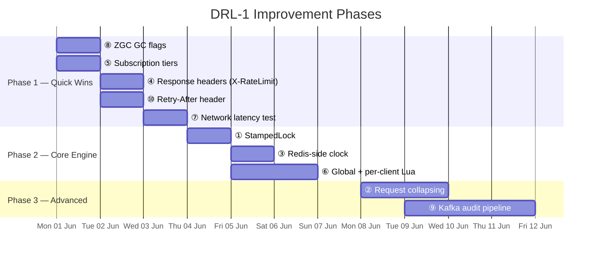

# DRL-1 Architecture Diagrams

---

## Diagram 2 — Improvement Overlays (10 Changes)

```mermaid
%% DRL-1 Improvement Overlays — changes mapped to components
%% ==========================================================

flowchart TD
    subgraph Legend["LEGEND"]
        L_CURRENT["Current (unchanged)"]
        L_IMPROVEMENT["🔧 Improvement"]
        L_NEW["🆕 New component"]
    end

    subgraph Edge["🌐 EDGE"]
        CLIENT["Client / VU"]
        CLIENT --> GW["API Gateway"]
    end

    subgraph Pod["📦 RATE LIMITER POD"]
        direction TB

        GW --> RL["RateLimitInterceptor"]

        subgraph Web["Web Layer"]
            RL
            RL -->|"extractClientId()"| EXTRACT["Extract Client ID"]
            EXTRACT -->|"client-xyz"| RULE["RateLimitRuleService"]

            I4["④ X-RateLimit-* Headers\nX-RateLimit-Limit\nX-RateLimit-Remaining\nX-RateLimit-Reset"]
            I10["⑩ Retry-After Header\nRFC 1123 date\non HTTP 429"]
            I5["⑤ Subscription Tiers\nMap<String, RateLimitRule>\nfree_ → 10 at 0.16/s\npro_ → 100 at 5/s\nent_ → 1000 at 50/s"]

            RL -.-> I4
            RL -.-> I10
            RULE -.-> I5
        end

        subgraph Engine["Core Engine"]
            ENGINE["RateLimitEngine\ncheckAndConsume()"]

            subgraph Local["Local Cache"]
                LB["LocalBucket"]
                I1["① StampedLock\nsynchronized → ReadWriteLock\nconcurrent reads\nserialized writes"]
                I2["② Request Collapsing\nCompletableFuture<Double>\n24/25 wait on 1 result\ntimeout=200ms"]
                LB -.-> I1
                LB -.-> I2
            end

            subgraph Dist["Distributed Layer"]
                LUA["Lua Script\nTOKEN_BUCKET"]
                CB["Circuit Breaker"]
                REDIS_CLIENT["Lettuce Client"]
                I3["③ Redis-Side Clock\nredis.call('TIME')\nreplaces Java now param\neliminates clock skew"]
                I6["⑥ Global + Per-Client\nrl:global + rl:clientId\nboth in one atomic script"]
                I7["⑦ Network Latency Test\ntc qdisc netem delay 2ms\nvalidate p99 < 15ms"]

                LUA -.-> I3
                LUA -.-> I6
                REDIS_CLIENT -.-> I7
            end

            ENGINE --> LB
            LB --> CB
            CB --> LUA
            LUA --> REDIS_CLIENT
        end

        subgraph Obs["Observability"]
            LOGGER["Logback JSON\nper-request logs"]
            MICROMETER["Micrometer\ncounters + histograms"]
            I9["⑨ Kafka Audit Log 🆕\nAvro → rate-limit-decisions topic\nSpark Streaming → billing\nFlink → anomaly detection"]

            LOGGER -.->|"also produce to"| I9
        end

        subgraph JVM["JVM"]
            I8["⑧ ZGC Garbage Collector\n-XX:+UseZGC\n-XX:+ZGenerational\n-XX:ConcThreads=2\n-Xmx256m\n→ sub-ms pause times"]
        end
    end

    subgraph Data["🗄️ DATA LAYER"]
        REDIS["Redis\n(unchanged)"]
        REDIS_CLIENT --> REDIS
    end

    subgraph Observe["📊 OBSERVABILITY STACK (unchanged)"]
        PROM["Prometheus"]
        LOKI["Loki"]
        GRAFANA["Grafana"]
        MICROMETER --> PROM
        LOGGER --> LOKI
        PROM --> GRAFANA
        LOKI --> GRAFANA
        I9 -->|"Kafka topic"| KAFKA["🆕 Kafka / Redpanda"]
        KAFKA --> SPARK["🆕 Spark Streaming\nhourly billing agg"]
        KAFKA --> FLINK["🆕 FlinkCEP\nanomaly detection"]
        KAFKA --> CLICKHOUSE["🆕 ClickHouse\n6mo retention"]
    end

    subgraph Results["EXPECTED IMPACTS"]
        R1["① p50 cut ~40%\nno lock contention"]
        R2["② -96% Redis calls\n(25→1 per TTL window)"]
        R3["③ Zero clock skew\nmulti-replica safe"]
        R4["④ Client compliance\nstandard practice"]
        R5["⑤ Zero-cost tiering\nno extra Redis calls"]
        R6["⑥ Abuse protection\natomic dual bucket"]
        R7["⑦ Validated p99 < 15ms\nunder 2ms network RTT"]
        R8["⑧ Sub-ms GC pauses\nvs G1 5-15ms"]
        R9["⑨ Replayable audit\nbilling + anomaly"]
        R10["⑩ Bots back off\nCDN cache 429s"]
    end

    I1 -.-> R1
    I2 -.-> R2
    I3 -.-> R3
    I4 -.-> R4
    I5 -.-> R5
    I6 -.-> R6
    I7 -.-> R7
    I8 -.-> R8
    I9 -.-> R9
    I10 -.-> R10

    %% Styling
    classDef unchanged fill:#0d1b2a,stroke:#555,stroke-width:1,color:#888
    classDef improvement fill:#2d1b00,stroke:#ff9900,stroke-width:2,color:#ff9900
    classDef new fill:#0d3310,stroke:#00e676,stroke-width:2,color:#00e676
    classDef result fill:#1a1a2e,stroke:#e94560,stroke-width:1,color:#e94560
    classDef legendCur fill:#0d1b2a,stroke:#555,stroke-width:1,color:#888
    classDef legendImp fill:#2d1b00,stroke:#ff9900,stroke-width:2,color:#ff9900
    classDef legendNew fill:#0d3310,stroke:#00e676,stroke-width:2,color:#00e676

    class CLIENT,GW,RL,EXTRACT,RULE,ENGINE,LB,LUA,CB,REDIS_CLIENT,REDIS,PROM,LOKI,GRAFANA,LOGGER,MICROMETER unchanged
    class I1,I2,I3,I4,I5,I6,I7,I8,I9,I10 improvement
    class KAFKA,SPARK,FLINK,CLICKHOUSE new
    class R1,R2,R3,R4,R5,R6,R7,R8,R9,R10 result
    class L_CURRENT legendCur
    class L_IMPROVEMENT legendImp
    class L_NEW legendNew
```

### Improvement Summary Table

| # | Change | File(s) | Lines Changed | Risk |
|---|--------|---------|---------------|------|
| ① | `synchronized` → `StampedLock` | `LocalBucket.java` | ~30 | Low |
| ② | Request collapsing `CompletableFuture` | `LocalBucket.java`, `RateLimitEngine.java` | ~25 | Low |
| ③ | `redis.call('TIME')` in Lua | Lua script in `RateLimitEngine.java` | ~3 | Low |
| ④ | `X-RateLimit-*` response headers | `RateLimitInterceptor.java` | ~8 | Low |
| ⑤ | Subscription tier prefix map | `RateLimitRuleService.java` | ~15 | Low |
| ⑥ | Global + per-client dual bucket | Lua script, `RateLimitEngine.java` | ~10 | Medium |
| ⑦ | `tc netem` latency test | Manual test script | N/A | None |
| ⑧ | ZGC flags | `docker-compose.yml` | ~2 | Low |
| ⑨ | Kafka Avro producer | `RateLimitAuditProducer.java`, schema | ~50 | Low |
| ⑩ | `Retry-After` header on 429 | `RateLimitInterceptor.java` | ~6 | Low |

---

## Phase Migration Map

